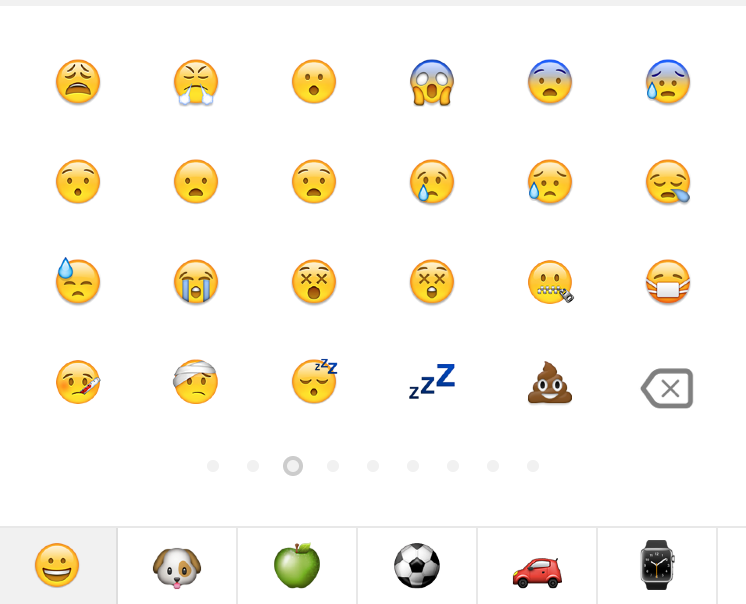

# React Native Emoji
react native emoji component


### latest screenshot sample


<!---->
## Install

```js
npm install react-native-emoji-select-board --save
```

## Usage

### UI Component

- step 1

	Import the component package.
	
	```js
	import EmojiBoard from 'react-native-emoji-select-board';
	```
- step 2

	Write the component code in the proper place of your page render.
	
	```js
	<EmojiBoard
		 onEmojiIconPress={this._onEmojiIconPress.bind(this)}
		 onBackspacePress={this._onBackspacePress.bind(this)}
		 show={this.state.showEmojiicons}
		 concise={true}
		 showHistoryBar={true}
		 showPlusBar={true}
     />
	```
	> **Tip:**  The attribute `onEmojiIconPress ` can get the emojiicos results like `{code:'😁', name: 'GRIMACING FACE'}`. The attribute `show ` will control that if the component is visible.  The attribute `onBackspacePress ` will add a function for backspace button. 

### props

| Prop | Type | Description | Required | Default |
|---|---|---|---|---|
|**`onEmojiIconPress `**|`Function `| callback function when the emojiicons is pressed |`Yes`|None|
|**`onBackspacePress `**|`Function `| callback function when the backspace button is pressed |`YES`|None|
|**`show `**|`Bool `| show the component |`YES`| false |
|**`concise `**|`Bool `| concise mod with less emoji |`No`| true |
|**`showHistoryBar `**|`Bool `| enable history function |`No`| true |
|**`showPlusBar `**|`Bool `| enable more emojiicons function(is on developing, if you have interesting on this, welcome pull request.)|`No`| true |
|**`asyncRender `**|`Bool `| async render |`No`| false |

### API

Import

```js
import * as emojiicons from 'react-native-emoji-select-board';
```

1. stringify
	
	```js
	//Most database can't restore the emoji string😤,so we map 
	//them to common string.
	
	const string = emojiicons.stringify('This is source emoji 😁');
	console.log(string);
	```
	```js
	//output
	'This is source emoji [GRIMACING FACE]'
	```
	
2. parse

	```js
	//If we want to show the emoji(fetch from database) in view page
	//we need parse the string
	
	const emoji = emojiicons.parse('This is source emoji [GRIMACING FACE]');
	console.log(emoji);
	```
	```js
	//output
	'This is source emoji 😁'
	```

3. splitter

	```js
	//this api is for backspace function
	const emoji = emojiicons.splitter('emoji😁');
	console.log(emoji);
	```
	```js
	//output
	['e','m','o','j','i','😁']
	```
